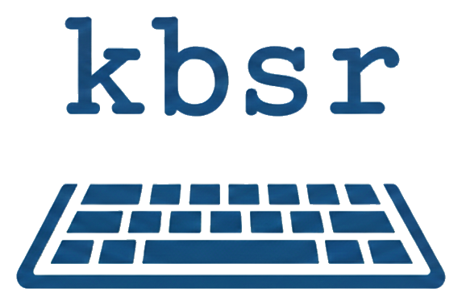

**Keybind Spaced Repetition** - Learn keyboard shortcuts by actually typing them, with spaced repetition scheduling.

[](https://asciinema.org/a/gXePg3GCR1SEEjgo)

Built with Rust and [ratatui](https://github.com/ratatui/ratatui), using the [FSRS](https://github.com/open-spaced-repetition/fsrs-rs) algorithm for optimal review scheduling.

## Features

- Learn keybindings by actually typing them
- Spaced repetition scheduling via the FSRS algorithm
- Two keyboard modes: **raw** (Shift-g, Shift-4) and **chars** (G, $)
- Multi-chord sequences like `Ctrl+K Ctrl+C` or `y s i w )`
- Visual feedback: green for correct chords, red for mistakes
- Pause/resume, card shuffling, session statistics
- Daily automatic database backups

## Installation

### Cargo

```bash
cargo install kbsr
```

### Nix

For pre-built binaries, add the cache first (optional, avoids compiling from source):

```bash
cachix use kbsr
```

Then install:

```bash
nix run github:dbalmain/kbsr
# or install persistently
nix profile install github:dbalmain/kbsr
```

### From source

```bash
git clone https://github.com/dbalmain/kbsr.git
cd kbsr
cargo install --path .
```

## Quick Start

1. Create a deck file at `~/.config/kbsr/decks/my-shortcuts.tsv`:

```tsv
Ctrl+S	Save file
Ctrl+Z	Undo
Ctrl+Shift+Z	Redo
g g	Go to top of file
```

2. Run `kbsr`, select your deck, and start typing keybinds.

Cards you get right are scheduled for future review. Cards you miss are repeated at the end of the session.

## Terminal Requirements

kbsr uses the Kitty keyboard protocol for key detection. Supported terminals include Kitty, WezTerm, Ghostty, and foot. Running inside tmux will mean you can't study your tmux keybinds. Similarly, if you're practicing your window manager keybinds, you'll need to disable them somehow.

## Documentation

- [Deck Format](docs/decks.md) - How to create and structure deck files
- [Configuration](docs/configuration.md) - All settings and their defaults
- [Usage Guide](docs/usage.md) - Study flow, controls, and tips

## File Locations

| File | Location |
|------|----------|
| Decks | `~/.config/kbsr/decks/*.tsv` |
| Config | `~/.config/kbsr/config.toml` |
| Database | `~/.local/share/kbsr/kbsr.db` |
| Backups | `~/.local/share/kbsr/kbsr.db.backup.YYYY-MM-DD` |

## Building

```bash
cargo build                    # Debug build
cargo build --release          # Release build
cargo test                     # Run tests
cargo clippy                   # Lint
cargo fmt                      # Format
```

## License

MIT
